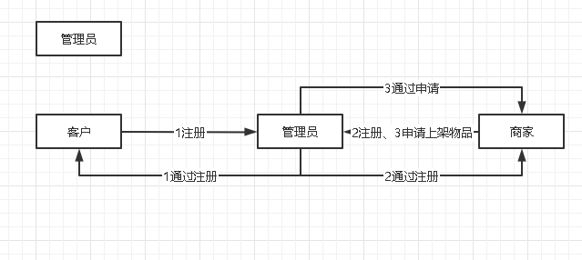
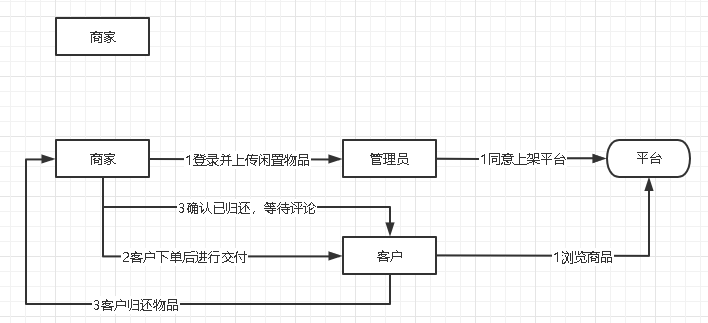
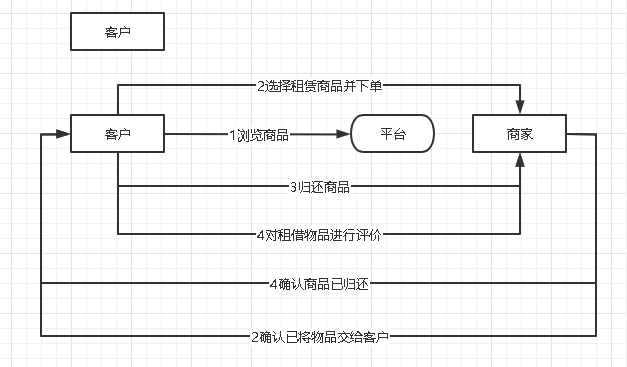

# 软件需求规格说明书

&emsp;&emsp;项目名称：校园闲置物品租赁平台

&emsp;&emsp;文件状态：文档在编写过程中

&emsp;&emsp;文档当前版本：V0.1.14

&emsp;&emsp;作者：特别爱学习小组全体成员

&emsp;&emsp;完成日期：2022年9月16日

&emsp;&emsp;使用人员：校园内对闲置物品有租出需求的学生和老师

&emsp;&emsp;背景：希望创立一个物品租赁平台，让闲置的物品重新焕发活力

## 任务概述

### 目标
&emsp;&emsp;构建一个可以直接应用于校园的租赁平台，允许同学在线发布自己的闲置物品；在后台审核通过之后，可以在线租赁，锁定该物品。同时可以针对租赁的物品，可以在线进行评论，对于物品进行评论反馈。

&emsp;&emsp;该系统由租赁平台和后台管理审核系统两个部分组成。后台管理审核，主要是负责对于用户人员、线上发布闲置物品的审核管理功能。 租赁平台主要是提供在线闲置物品的浏览和搜索，并提供用户下单租用的主要流程；同时提供用户注册，提供用户个人信息和租用历史记录等信息。

### 用户特点
#### &emsp;&emsp;本租赁平台面向：
        1.持有闲置物品并有出租意向的师生；
        2.想要短期使用某些物品的师生。
        包括但不限于以上用户。

### 应用环境
&emsp;&emsp;本平台适用于各类具有以上需求的用户所在的高校。

### 假定和约束
    1.时间上，本项目拟定于十一月前开发完成；
    2.软件开发成本
        1）软件开发费用XX元；
        2）软件测试费用XX元；
        3）软件维护费用（一年）XX元。
        包括但不限于以上成本。
    3.本平台受服务器与终端的信息传输的性能影响，不同设备或者不同运营商的网络状况可能会造成不同的访问速率；
    4.建议使用chrome 103.0.1343.42以上版本的浏览器访问本平台。
    5.可能遇到的风险：
    平台在线访问人数超过一定数量，可能会导致平台崩溃。

## 需求规定
### 对功能的规定
&emsp;&emsp;
#### 总体说明
##### 这是一个闲置物品租赁平台，包括普通用户和商家两个角色

&emsp;&emsp;用户信息包括：账号、密码、头像、钱包余额、租赁的物品

&emsp;&emsp;用户可以使用账号密码登录平台，选择自己想要的商品加入收藏夹，支持一键下单收藏夹中的物品。

&emsp;&emsp;用户拥有钱包功能，可以进行充值。

&emsp;&emsp;用户在收藏夹中一键下单，用户账号会被扣除对应物品的租金以及保证金。

&emsp;&emsp;商家信息包括：账号、密码、上架的商品

&emsp;&emsp;商家可以登录平台，在平台上在线发布/下架租赁物品，同时设置该物品的保证金，发布闲置物品信息：一张图片、该商品可以出租的时间以及租金。

&emsp;&emsp;支持用户在租赁时间内归还，用户点击归还按钮后，系统退回保证金。若超出规定的租赁时间，则系统不退回保证金。

&emsp;&emsp;

#### 业务流程
&emsp;&emsp;管理员：

&emsp;&emsp;商家

&emsp;&emsp;客户

### 对性能的规定
#### 总体说明
&emsp;&emsp;在服务器性能充沛的前提下，本系统最多可容纳50人同时访问本租赁平台。

&emsp;&emsp;注：若同时访问人数过多，可能导致平台的崩溃。

#### 精度
        1.钱款数精确到0.01圆；
        2.物品尺寸精确到1厘米；
        3.租赁时间精确到1小时。

#### 时间特性要求
&emsp;&emsp;在服务器正常运作的情况下，用户提出请求之后，平台将会在20ms内响应用户的需求。

#### 灵活性
&emsp;&emsp;本平台可以使用各种设备进行访问，例如，移动设备、PC端等。

### 对输入输出的要求
&emsp;&emsp;用户可根据界面的提示以及自身需求进行操作。

### 数据管理能力要求
&emsp;&emsp;主页最多可以同时访问20条物品信息。

### 故障处理要求
&emsp;&emsp;当平台发生故障时，会自动回滚当前所有正在进行中的交易，若因平台故障导致的任何损失，由平台进行评估赔偿。

## 运行环境规定
### 设备
&emsp;&emsp;能使用并访问浏览器的设备。
### 支持软件
&emsp;&emsp;Microsoft Edge、Chrome、FireFox等浏览器均可正常访问。建议使用具有Chrome内核的浏览器。

## 签字
### 需求方 
&emsp;&emsp;北京市XX有限公司
### 开发方
&emsp;&emsp;特别爱学习小组